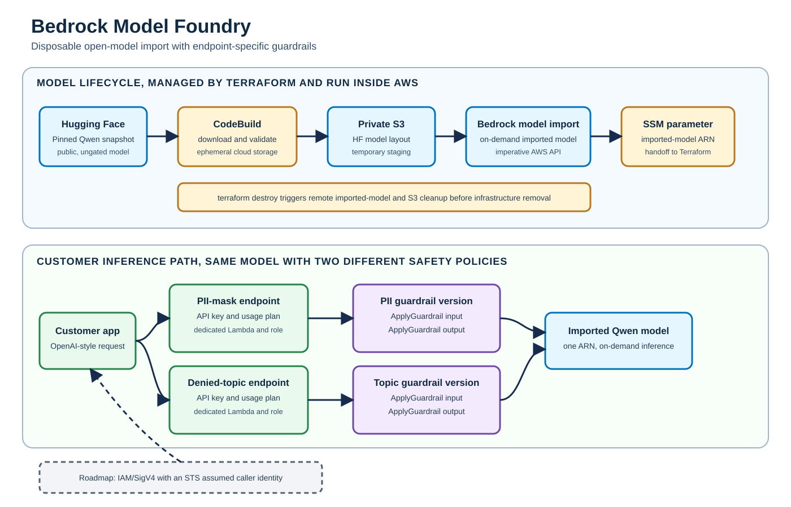

# Bedrock Model Foundry

Bedrock Model Foundry is a disposable demo for importing an open Hugging Face model into Amazon Bedrock and putting different guardrails in front of the same model.

The default model is [Qwen/Qwen2.5-1.5B-Instruct](https://huggingface.co/Qwen/Qwen2.5-1.5B-Instruct), pinned to commit `775b11afaf83e0dc75bd5abaf90133e47b3ec082`. It uses the Qwen2 architecture supported by Bedrock Custom Model Import. The selected model is not one of the native Qwen 3 foundation models in the current Bedrock catalog.



## What the demo creates

Terraform provisions:

- a private S3 bucket for temporary model staging;
- a CodeBuild job that downloads the model inside AWS;
- the IAM role Bedrock uses to read the staged model;
- a Bedrock imported model;
- two API Gateway REST endpoints backed by separate Lambda functions;
- one immutable Bedrock guardrail version per endpoint;
- API keys, usage plans, short log retention, and teardown hooks.

The `pii-mask` endpoint anonymizes email addresses, names, and phone numbers. The `denied-topic` endpoint blocks requests to reveal or exchange authentication secrets. Both endpoints call the same imported model.

Model weights never download to the operator's computer. Terraform uploads the small lifecycle script, starts CodeBuild, and waits. CodeBuild handles the Hugging Face snapshot, S3 upload, Bedrock import, and cleanup.

## Cost and teardown warning

A successful invocation of an imported model starts Bedrock Custom Model Unit billing in timed windows. Run `terraform destroy` when the demo is over.

A dedicated cleanup anchor is created before the fallible import starts. Its destroy hook starts CodeBuild in cleanup mode before Terraform removes the project, even when the import resource was tainted by a failed apply. Cleanup deletes the imported model and staged model prefix. The S3 bucket also has `force_destroy = true` because this repository is only for a disposable demo.

## Prerequisites

The deployment machine needs:

- Terraform 1.6 or newer;
- AWS CLI v2;
- AWS credentials for IAM, S3, SSM, CodeBuild, CloudWatch, Lambda, API Gateway, and Bedrock Custom Model Import;
- outbound access from CodeBuild to `huggingface.co`;
- Bedrock Custom Model Import quota in the selected Region.

Supported Regions for this configuration are `us-east-1`, `us-east-2`, `us-west-2`, and `eu-central-1`.

This workstation blocks direct Hugging Face traffic through its web filter. That does not affect the design because CodeBuild performs the download. Live deployment should run from an AWS account and network that permit the required calls.

## Offline checks

Create the environment once, then run the checks:

```bash
python3 -m venv .venv
.venv/bin/python -m pip install -r requirements-dev.txt
./scripts/check.sh
```

`scripts/check.sh` uses `.venv` when it exists and the system interpreter
otherwise. Set `PYTHON` to choose a different one.

The check script compiles the Python sources, runs unit tests, checks shell syntax, formats Terraform, validates Terraform when providers are initialized, and parses the SVG.

## Deploy

Copy the example settings if you need to change the Region or tags:

```bash
cp terraform/terraform.tfvars.example terraform/terraform.tfvars
```

One command deploys and leaves the demo ready to talk to:

```bash
./scripts/demo-up.sh
```

It applies, writes the harness configuration, waits for the API key to
propagate, warms the imported model, and prints the summary below. The steps
are also available individually.

Initialize, review, and apply:

```bash
terraform -chdir=terraform init
terraform -chdir=terraform plan -out=demo.tfplan
terraform -chdir=terraform apply demo.tfplan
```

The apply can take a while. CodeBuild downloads about 3 GB of model weights, uploads the snapshot to S3, submits the import job, and waits for Bedrock.

Every apply ends with a readable summary of what was deployed:

```text
Bedrock Model Foundry - us-east-1 / 000000000000

endpoints
  denied-topic  https://aaaaaaaaaa.execute-api.us-east-1.amazonaws.com/demo/v1/chat/completions
                guardrail aaaaaaaaaaaa v1 - blocks credential-sharing
  pii-mask      https://bbbbbbbbbb.execute-api.us-east-1.amazonaws.com/demo/v1/chat/completions
                guardrail bbbbbbbbbbbb v1 - anonymizes email, name, phone

model         arn:aws:bedrock:us-east-1:000000000000:imported-model/xxxxxxxxxxxx
build project bedrock-model-foundry-model-lifecycle

api keys      terraform -chdir=terraform output -json endpoint_api_keys
              (the harness config holds them; they are never printed here)

next          python3 scripts/generate-harness-config.py
              python3 harness/foundry_shim.py
              opencode
```

The summary carries no API key, so it is safe to leave on a shared screen.
`scripts/generate-harness-config.py` also writes it to `demo-endpoints.txt`,
which Git ignores, for a second window during a demonstration.

Retrieve the endpoint URLs:

```bash
terraform -chdir=terraform output -json endpoint_urls
```

Retrieve API keys only when needed. Terraform marks this output sensitive:

```bash
terraform -chdir=terraform output -json endpoint_api_keys
```

Do not paste API keys into source files, tickets, or logs. Sensitive outputs are still stored in Terraform state. For a shared deployment, use an encrypted remote backend with narrowly scoped access, retain state only as long as needed, and rotate the demo keys after use. Local state files are excluded from Git.

## Run the live checks

After apply completes:

```bash
python3 scripts/smoke-test.py
```

The script checks missing-key rejection, normal inference on both endpoints, PII anonymization, denied-topic blocking, and the imported-model restore path. It reports time to first successful response for each endpoint. A cold model can return `ModelNotReadyException`. The Lambda maps that state to HTTP 503, and the smoke client retries for up to five minutes without printing API keys.

## Drive the endpoints from a local agent harness

The endpoints are OpenAI-shaped, but an agent harness sends more than the
endpoint accepts: `stream`, `tools`, and `tool_choice` are outside the
allowlist in `validate_parameters`, and API Gateway reads the key from
`x-api-key` rather than an `Authorization` header. `harness/foundry_shim.py`
is a local translator for exactly those differences. It adds no intelligence
and makes no policy decision; both guardrails still run in AWS.

Generate the configuration from the deployed outputs, then start the shim:

```bash
python3 scripts/generate-harness-config.py
python3 harness/foundry_shim.py --keep-warm
```

`--keep-warm` pings the endpoint every four minutes, inside the five-minute
billing window, so the model does not scale to zero between questions. Without
it a pause in the conversation costs the next question a restore of about a
minute.

The generator writes `harness/foundry-endpoints.json` with the endpoint URLs
and API keys, and a project-level `opencode.json` that points at the shim and
contains no secret. Git ignores both.

The generator also writes `demo-endpoints.txt`, the same summary Terraform
prints, so the URLs and guardrail versions stay visible while the harness runs.

Run `opencode` from this directory. Every deployed endpoint is registered as a
model:

```bash
opencode models | grep foundry
```

```text
foundry/denied-topic
foundry/pii-mask
```

Switching model switches guardrail, against the same imported model, without
leaving the conversation:

| Key | Effect |
|---|---|
| `F2` | next recently used model; with two endpoints registered this toggles between them |
| `ctrl+x` then `m` | open the model picker |
| `/models` | the same picker, typed |

That makes the demonstration a single keystroke: ask a question that carries
an email address, press `F2`, and ask it again. The anonymizing endpoint
returns the address masked and the other returns it intact, from one model,
because the endpoint configuration and not the model decides the policy. Ask
the credential question on `foundry/denied-topic` and the request is refused
before inference.

A blocked request arrives as an assistant turn carrying the guardrail's own
message, so the refusal appears in the transcript instead of as a client-side
error.

Any OpenAI-compatible client can use the shim by pointing its base URL at
`http://127.0.0.1:8787/v1`. `scripts/smoke-test.py` and the endpoints
themselves do not depend on it.

## Destroy

```bash
./scripts/demo-down.sh
```

That stops the local shim, destroys the stack, runs the teardown audit, and
removes the generated configuration. The individual steps:

```bash
terraform -chdir=terraform plan -destroy -out=destroy.tfplan
terraform -chdir=terraform apply destroy.tfplan
```

Audit the account after destroy using the same project name and Region:

```bash
python3 scripts/audit-teardown.py \
  --project-name bedrock-model-foundry \
  --region us-east-1
```

The audit fails if it finds an in-progress import job, the imported model, staging bucket, lifecycle project, SSM parameter, endpoint Lambdas, REST APIs, API keys, usage plans, guardrails, IAM roles, or managed log groups. For custom endpoint keys, repeat `--endpoint <key>` for every configured endpoint. If you changed `imported_model_name`, pass the same value with `--model-suffix`.

If destroy stops during remote cleanup, inspect the CodeBuild logs before retrying. See [troubleshooting](docs/troubleshooting.md).

## Add a guardrail or endpoint

Add an entry to the `endpoints` map in `terraform/variables.tf`, or override that map in `terraform.tfvars`. Each entry creates its own guardrail version, Lambda role, Lambda function, REST API, API key, and usage plan. Endpoint objects also carry the model key, quota, throttle, and tags.

The module currently supports two policy shapes:

- `pii`, with an allowlisted set of Bedrock PII entity types;
- `topic`, with a denied-topic name, definition, and examples.

Run `terraform plan` and review the new endpoint resources before applying.

## Add a model

The `models` input is map-shaped, but this version deliberately validates exactly one active entry under the `default` key. To change the reviewed model definition:

1. confirm that Bedrock Custom Model Import supports the model architecture and tokenizer;
2. pin a full Hugging Face commit hash;
3. update the Terraform allowlist and the Python metadata validation together;
4. run the offline checks;
5. deploy in a disposable AWS account and record import size, time, CMU count, and cold-start behavior.

Multiple simultaneous imported models are listed in [the roadmap](docs/roadmap.md).

## Repository map

```text
docs/
  architecture/              customer diagram and editable Mermaid source
  superpowers/               approved design and implementation plan
  cloud-requirements.md      access required to run this demo
  roadmap.md                 IAM adoption and platform extension notes
  troubleshooting.md         import-role and environment checks
harness/
  foundry_shim.py            local OpenAI-compatible adapter for agent harnesses
scripts/
  check.sh                   offline verification
  demo-up.sh                 deploy, wait out propagation, warm the model
  demo-down.sh               destroy, audit, remove generated files
  generate-harness-config.py harness configuration from Terraform outputs
  run-codebuild.sh           Terraform's remote-job waiter
  audit-teardown.py          credentialed post-destroy resource audit
  smoke-test.py              credentialed endpoint checks
src/
  endpoint/app.py            guardrail and inference Lambda
  model_lifecycle.py         CodeBuild download/import/cleanup worker
terraform/
  modules/guarded_endpoint/  endpoint, guardrail, IAM, Lambda, and API module
  *.tf                       lifecycle infrastructure and two demo endpoints
tests/                       offline Python tests
```

## Known limits

- Bedrock model import is not a Terraform resource. A `terraform_data` provisioner starts the remote CodeBuild lifecycle job.
- The demo uses API keys. The production path uses API Gateway IAM authorization and assumed identities.
- The proxy uses `ApplyGuardrail` before and after inference because that path is model independent. It scans each chat content field separately so anonymization preserves system, user, assistant, and tool roles. Inline guardrails on imported-model calls remain a live compatibility test.
- API Gateway cannot wait through a long model restore. The client handles bounded 503 retries.
- Lambda emits structured status, stage, AWS error code, and request ID fields without prompt bodies. Set `api_gateway_access_log_destination_arn` to enable structured REST access logs when the account-wide API Gateway CloudWatch role and destination log group are managed by an adoption stack. The disposable demo does not replace that shared account setting.
- The OpenAI-shaped request accepts messages plus `model`, `max_tokens`, `temperature`, `top_p`, `stop`, and `response_format`. The model field is ignored because the endpoint pins its model. Unsupported fields return HTTP 400.
- This repository has no long-term support or availability target.
