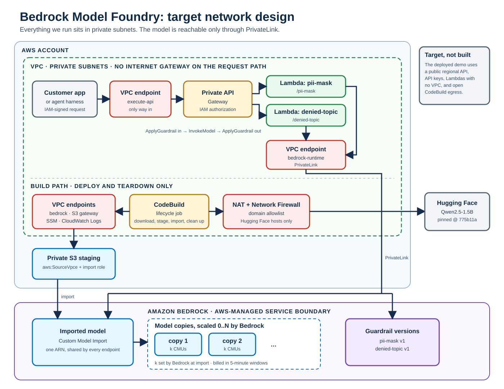

# Bedrock Model Foundry: target network design

Status: target design. Nothing on this page is built yet. The deployed demo
uses a public regional API Gateway with API keys, Lambdas outside any VPC,
and CodeBuild with open internet egress.

## Goal

Serve an open-weight Hugging Face model through Amazon Bedrock so that every
component we run sits in private subnets, every request stays on the AWS
network, and the one internet connection in the system is a build-time
download from an allowlisted host.

Two properties from the current demo carry over unchanged:

- **One model, many policies.** Each endpoint differs only in its guardrail.
  All endpoints call the same imported model.
- **Weights never touch an operator machine.** CodeBuild downloads, stages,
  and imports them inside AWS.

## Diagram

Editable source: [bedrock-model-foundry-target.mmd](bedrock-model-foundry-target.mmd).

## Where inference runs

Inference does not run in our VPC and cannot be made to. With Custom Model
Import, Bedrock hosts the model on AWS-managed compute:

- Compute is billed in **Custom Model Units (CMUs)**. Each model copy
  consumes `k` CMUs, where Bedrock sets `k` at import time from the model's
  size and architecture (`GetImportedModel` returns
  `customModelUnitsPerModelCopy`). There is no instance type to choose.
- Bedrock adds and removes copies with load and scales to zero after about
  five minutes idle. Billing runs in five-minute windows per active copy.
- An endpoint is not attached to a copy. The Lambda calls `InvokeModel` on
  the imported-model ARN and Bedrock routes the call to an available copy.

The isolation claim is therefore: **everything we operate is inside the VPC,
and the only route to the model is a PrivateLink interface endpoint.**

## Request path

1. The client, inside the VPC or connected to it, calls the private API
   through the `execute-api` VPC endpoint. The API resource policy rejects
   any call that does not arrive through that endpoint.
2. API Gateway authorizes the caller with IAM and invokes the endpoint's
   Lambda.
3. The Lambda runs `ApplyGuardrail` on the input, `InvokeModel` on the
   imported model, and `ApplyGuardrail` on the output. All three calls go
   through the `bedrock-runtime` VPC endpoint.

## Build path

1. CodeBuild runs in private subnets. Its only internet route is a NAT
   gateway behind AWS Network Firewall with a domain allowlist for Hugging
   Face. Model downloads redirect to Hugging Face CDN hosts, so the allowlist
   has to include those; confirm the exact host list during the first build.
2. CodeBuild writes the snapshot to S3 through the S3 gateway endpoint,
   starts the import through the `bedrock` endpoint, and records the model
   ARN in SSM.
3. Bedrock's import job reads the bucket with the import role from the
   service side, not through our VPC. The bucket policy must allow that role
   in addition to requiring `aws:SourceVpce` for everything else.

This path runs at deploy and teardown only. It is never on the request path.

## Changes from the current demo

| Area | Today | Target |
|---|---|---|
| API | `REGIONAL` API Gateway, public | `PRIVATE` API Gateway behind an `execute-api` VPC endpoint |
| Caller auth | API key | IAM authorization |
| Lambda | No VPC | Private subnets, `bedrock-runtime` VPC endpoint |
| CodeBuild | Open egress | Private subnets, NAT + Network Firewall allowlist |
| S3 staging | Private bucket | Private bucket, VPC-endpoint policy plus import-role exception |
| Model compute | Bedrock-managed CMUs | Unchanged |

## Open questions

- **Demo access.** A private API means the laptop running the opencode
  harness needs a way into the VPC: Client VPN, or an SSM port forward
  through an instance in the VPC. The shim would then point at that path.
- **Cost floor.** NAT gateway, Network Firewall, and five or six interface
  endpoints bill hourly whether or not the model is warm. That changes the
  demo's near-zero idle cost.
- **Inline guardrails.** Whether guardrails can run inline on imported-model
  calls is still untested. Networking does not depend on the answer.
